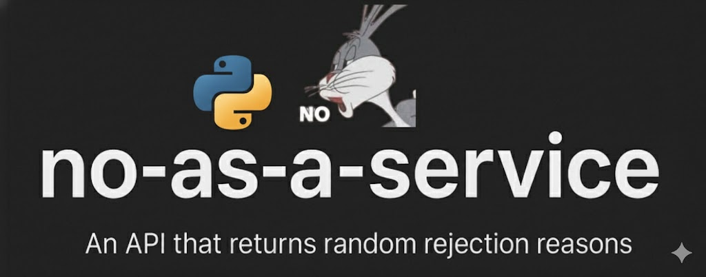

# ❌ No-as-a-Service Python 🐍

<p align="center">
  
</p>


Ever needed a graceful way to say "no"?  
This tiny API returns random, generic, creative, and sometimes hilarious rejection reasons — perfectly suited for any scenario: personal, professional, student life, dev life, or just because.

Built for humans, excuses, and humor.

## ✨ New Features in Python Port

- **Rate Limiting**: Built-in rate limiting (120 requests/minute per IP) using SlowAPI
- **Cloudflare Support**: Automatically detects real IP addresses behind Cloudflare proxies
- **Docker Ready**: Includes Dockerfile for easy containerized deployment
- **Async Performance**: Uses FastAPI with async file operations for better performance

---

## 🚀 API Usage

**Base URL**
```
https://nass.archax.site/no
```

**Method:** `GET`  
**Rate Limit:** `120 requests/minute per IP`

### 🔄 Example Request
```http
GET /no
```

### ✅ Example Response
```json
{
  "reason": "This feels like something Future Me would yell at Present Me for agreeing to."
}
```

Use it in apps, bots, landing pages, Slack integrations, rejection letters, or wherever you need a polite (or witty) no.

---

## 🛠️ Self-Hosting

Want to run it yourself? It’s lightweight and simple.

### 1. Clone this repository
```bash
git clone https://github.com/CodemHax/no-as-a-service-python.git
cd no-as-a-service
```

### 2. Install dependencies
```bash
pip install -r requirements.txt
```

### 3. Run the server
```bash
python -m uvicorn api.index:app --host 0.0.0.0 --port 8000
```

Or from the api directory:
```bash
cd api
python index.py
```

The API will be live at:
```
http://localhost:8000/no
```

### 🐳 Docker Deployment

Build and run with Docker:
```bash
docker build -t no-as-a-service .
docker run -p 8000:8000 no-as-a-service
```

### ▲ Vercel Deployment

Deploy to Vercel with one click:

[](https://vercel.com/new/clone?repository-url=https://github.com/CodemHax/no-as-a-service-python)

Or using Vercel CLI:
```bash
npm i -g vercel
vercel
```

The project includes a `vercel.json` configuration file for automatic deployment.

---

## 📁 Project Structure

```
└── no-as-a-service
    ├── README.md
    ├── requirements.txt    # Python dependencies
    ├── Dockerfile          # Docker configuration
    ├── reasons.json       # 1000+ universal rejection reasons
    ├── api/
    │   └── index.py       # FastAPI application
    └── assets/
        └── imgs/          # Banner images
```

---

## 👤 Author

Created with creative stubbornness by [hotheadhacker](https://github.com/hotheadhacker)

Ported to Python by [CodemHax](https://github.com/CodemHax)

---

## 📄 License

MIT - as original project.